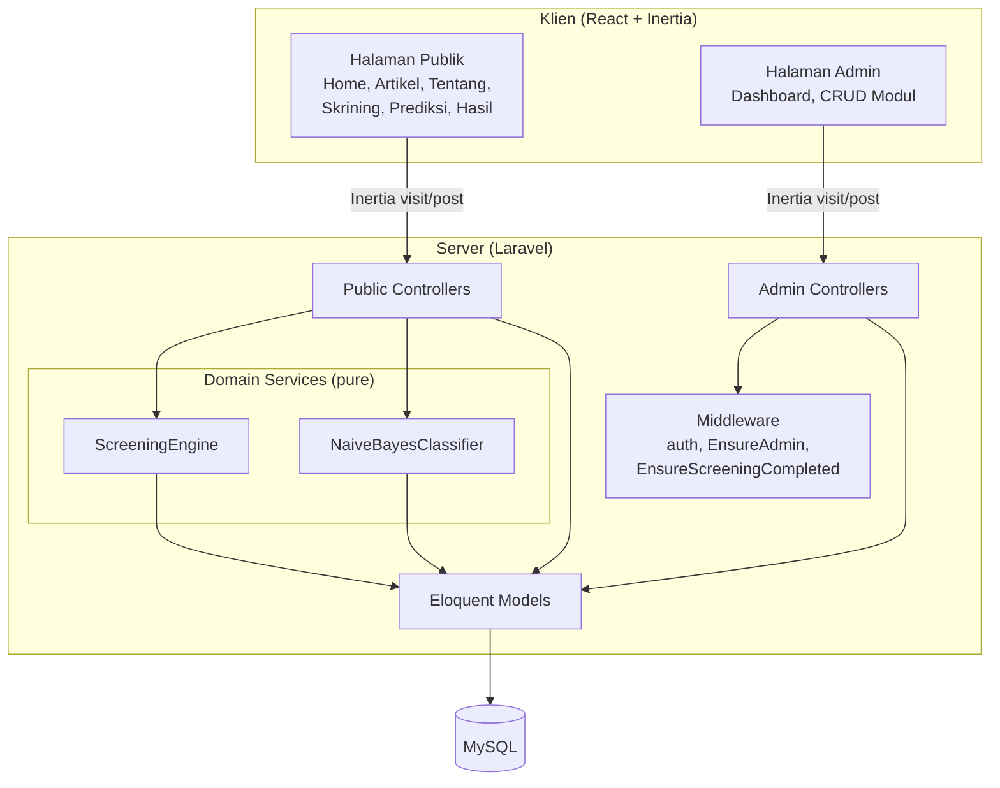
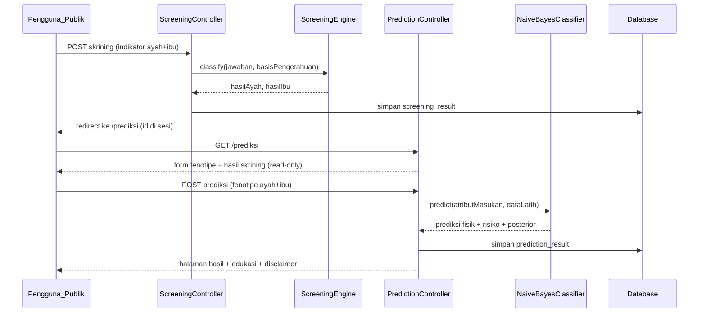
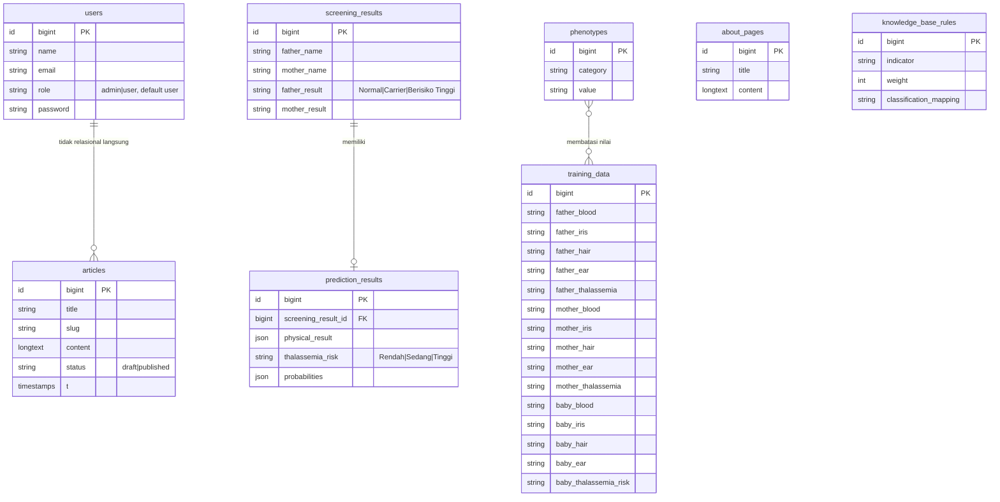

# Design Document

## Overview

GENETIKAKU adalah sistem pakar berbasis web yang dibangun di atas scaffold Laravel + Inertia.js + React yang sudah ada. Sistem melayani dua aktor: **Pengguna_Publik** (tanpa autentikasi) yang menjalankan alur skrining–prediksi empat tahap, dan **Admin** (terautentikasi, peran `admin`) yang mengelola konten dan data pendukung.

Inti komputasi sistem terdiri dari dua mesin domain murni (pure logic) yang dapat diuji secara terisolasi:

1. **Mesin_Skrining** — memetakan jawaban Indikator_Skrining seorang orang tua ke salah satu dari tiga kategori risiko (`Normal`, `Carrier`, `Berisiko Tinggi`) berdasarkan Basis_Pengetahuan yang dikelola Admin.
2. **Mesin_Naive_Bayes** — mengklasifikasikan karakteristik fisik bayi dan Risiko_Thalassemia_Bayi dari Data_Latih menggunakan probabilitas prior, likelihood (dengan Laplace smoothing), dan posterior.

Sisanya adalah pengelolaan konten (artikel, halaman tentang), pengelolaan data (fenotipe, data latih, basis pengetahuan, hasil prediksi), navigasi publik, dan penerapan Design_System "Publication" dengan aksesibilitas WCAG 2.2 AA.

### Design Decisions Kunci

- **Mesin domain sebagai service murni**: `ScreeningEngine` dan `NaiveBayesClassifier` diimplementasikan sebagai kelas PHP murni yang menerima input eksplisit dan mengembalikan hasil deterministik. Hal ini membuat keduanya mudah diuji dengan property-based testing dan memisahkan logika dari I/O (HTTP, Eloquent).
- **State antar-tahap melalui record tersimpan + referensi sesi**: Hasil Tahap 1 disimpan sebagai `screening_result` di database, dan id-nya disimpan di sesi pengguna. Tahap 2 mengambil hasil itu untuk pre-fill dan guard. Ini memenuhi Req 1.6, 2.3, dan 2.4 tanpa memerlukan login publik.
- **Inertia sebagai jembatan server↔klien**: Controller mengembalikan halaman Inertia dengan props; tidak ada REST API terpisah. Reaktivitas Data_Fenotipe (Req 13.2) dicapai dengan Inertia partial reload pada form prediksi.
- **MySQL** sebagai database produksi (sesuai requirements), menggantikan SQLite scaffold. Migrasi ditulis agar kompatibel dengan keduanya untuk pengujian lokal.

## Architecture



### Alur Empat Tahap (Pengguna_Publik)



### Lapisan Sistem

- **Presentation**: Halaman React/Inertia di `resources/js/pages/`, dipisah `public/` dan `admin/`. Reusable UI di `resources/js/components/`. Layout publik baru (`public-layout.tsx`) terpisah dari `app-layout.tsx` admin.
- **HTTP**: Controllers di `app/Http/Controllers/Public/` dan `app/Http/Controllers/Admin/`. Validasi via Form Request. Otorisasi via middleware.
- **Domain**: Service murni di `app/Services/` (`ScreeningEngine`, `NaiveBayesClassifier`) plus value objects/DTO di `app/Domain/`.
- **Persistence**: Eloquent models di `app/Models/`, migrasi di `database/migrations/`, seeder untuk Data_Fenotipe & Data_Latih awal.

## Components and Interfaces

### Domain Services

#### ScreeningEngine

Bertanggung jawab atas Tahap 1 (Req 1). Murni: tidak menyentuh database secara langsung; menerima Basis_Pengetahuan sebagai argumen.

```php
namespace App\Services;

final class ScreeningEngine
{
    /**
     * @param array<string,mixed> $answers  jawaban indikator skrining satu orang tua
     * @param KnowledgeBaseRule[] $rules     aturan/bobot dari Basis_Pengetahuan
     * @return ScreeningCategory  Normal | Carrier | BerisikoTinggi
     */
    public function classify(array $answers, array $rules): ScreeningCategory;
}
```

- Menjumlahkan bobot indikator yang terpenuhi sesuai `rules`, lalu memetakan total skor ke kategori menggunakan ambang batas (threshold) yang juga berasal dari Basis_Pengetahuan.
- Selalu mengembalikan tepat satu `ScreeningCategory` (enum) untuk input lengkap (Req 1.3).

#### NaiveBayesClassifier

Bertanggung jawab atas Tahap 3 (Req 3). Murni: menerima Data_Latih sebagai argumen.

```php
namespace App\Services;

final class NaiveBayesClassifier
{
    /**
     * @param array<string,string> $input  atribut masukan (fenotipe ayah/ibu + hasil skrining)
     * @param TrainingRow[]         $training
     * @return PredictionOutcome   prediksi per variabel keluaran + posterior
     * @throws EmptyTrainingDataException  bila $training kosong (Req 3.8)
     * @throws InvalidAttributeException   bila ada nilai input tak terdaftar (Req 3.1)
     */
    public function predict(array $input, array $training): PredictionOutcome;
}
```

Algoritma per variabel keluaran (mis. golongan darah bayi, iris, rambut, cuping, risiko thalassemia bayi):

1. **Prior**: `P(c) = count(class = c) / N` untuk setiap kelas `c` (Req 3.3).
2. **Likelihood dengan Laplace smoothing** (Req 3.4, 3.7):
   `P(x_i | c) = (count(x_i, c) + 1) / (count(c) + V_i)`
   dengan `V_i` = jumlah nilai distinct atribut `i`. Smoothing memastikan likelihood tak pernah nol.
3. **Posterior (tak ternormalisasi)**: `score(c) = P(c) * Π_i P(x_i | c)` (Req 3.5).
4. **Pemilihan**: kelas dengan `score(c)` terbesar dipilih sebagai prediksi (Req 3.6). Posterior ternormalisasi `score(c) / Σ score` disertakan untuk ditampilkan (Req 4.3).

### HTTP Controllers (ringkasan endpoint)

| Area | Controller | Route | Method | Requirement |
|---|---|---|---|---|
| Publik | `HomeController` | `/` | GET | 6 |
| Publik | `ArticleController` | `/artikel`, `/artikel/{slug}` | GET | 7 |
| Publik | `AboutController` | `/tentang` | GET | 8 |
| Publik | `ScreeningController` | `/skrining`, `/skrining` | GET, POST | 1 |
| Publik | `PredictionController` | `/prediksi`, `/prediksi` | GET, POST | 2,3,4 |
| Publik | `PredictionController@print` | `/prediksi/{id}/cetak` | GET | 5 |
| Admin | `Admin\ArticleController` | resource `/admin/artikel` | CRUD | 10 |
| Admin | `Admin\AboutController` | `/admin/tentang` | GET, PUT | 11 |
| Admin | `Admin\KnowledgeBaseController` | resource `/admin/basis-pengetahuan` | CRUD | 12 |
| Admin | `Admin\PhenotypeController` | resource `/admin/fenotipe` | CRUD | 13 |
| Admin | `Admin\TrainingDataController` | resource `/admin/data-latih` | CRUD | 14 |
| Admin | `Admin\PredictionResultController` | `/admin/hasil-prediksi`, show, destroy | R, D | 15 |

### Middleware

- `EnsureUserIsAdmin`: menolak pengguna non-`admin`, redirect ke login (Req 9.3). Diterapkan pada grup `/admin`.
- `EnsureScreeningCompleted`: memeriksa keberadaan `screening_result_id` valid di sesi; jika tidak ada, redirect ke `/skrining` (Req 2.4).

### Frontend (Inertia/React)

- `public-layout.tsx`: layout publik dengan header navigasi (Home, Artikel, Tentang, Skrining) dan footer disclaimer (Req 6.2, 6.3).
- Halaman: `public/home`, `public/articles/index`, `public/articles/show`, `public/about`, `public/screening`, `public/prediction/form`, `public/prediction/result`, `public/articles/not-found`.
- `admin/*`: dashboard dan halaman CRUD per modul, memakai `app-layout.tsx`.
- Form prediksi memuat opsi fenotipe via props server dan menggunakan Inertia partial reload untuk merefleksikan perubahan Data_Fenotipe (Req 13.2).
- Komponen `PageState` (single source of truth) merender tepat satu dari loading/empty/error (Req 16.7).

## Data Models

### Skema Database



### Enum / Value Object

- `ScreeningCategory`: `Normal`, `Carrier`, `BerisikoTinggi`.
- `ThalassemiaRisk`: `Rendah`, `Sedang`, `Tinggi`.
- `PhenotypeCategory`: `GolonganDarah`, `WarnaIris`, `TeksturRambut`, `BentukCuping`.
- `TrainingRow`: DTO baris data latih.
- `PredictionOutcome`: `{ physical: array<category,value>, thalassemiaRisk, probabilities: array<variable, array<class,float>> }`.

### Catatan Validasi Data

- `training_data` baris ditolak bila nilai atribut tidak terdaftar di `phenotypes` (untuk kategori fenotipe) atau bukan kategori Hasil_Skrining_Orang_Tua yang valid (Req 14.3).
- `articles.status` membatasi visibilitas publik: hanya `published` yang tampil (Req 7.1, 7.3).
- `phenotypes` adalah satu-satunya sumber nilai valid pada form prediksi (Req 2.2).

## Correctness Properties

*A property is a characteristic or behavior that should hold true across all valid executions of a system — essentially, a formal statement about what the system should do. Properties serve as the bridge between human-readable specifications and machine-verifiable correctness guarantees.*

Properti berikut berfokus pada dua mesin domain murni (Mesin_Skrining, Mesin_Naive_Bayes), integritas data, dan invarian state UI — area di mana perilaku bervariasi bermakna atas banyak input sehingga property-based testing memberi nilai tertinggi. Operasi CRUD sederhana untuk artikel, halaman tentang, basis pengetahuan, dan fenotipe diuji dengan contoh/feature test (lihat Testing Strategy), bukan properti.

### Property 1: Klasifikasi skrining bersifat total dan deterministik

*For any* himpunan jawaban Indikator_Skrining yang lengkap dan *for any* Basis_Pengetahuan yang valid, `ScreeningEngine.classify` SHALL mengembalikan tepat satu nilai dari `{Normal, Carrier, Berisiko Tinggi}`, dan pemanggilan berulang dengan input yang sama SHALL menghasilkan kategori yang sama serta mencerminkan aturan/bobot yang diberikan.

**Validates: Requirements 1.2, 1.3, 12.2**

### Property 2: Skrining menolak indikator yang tidak lengkap

*For any* himpunan jawaban di mana satu atau lebih Indikator_Skrining wajib hilang, proses skrining SHALL menolak pengiriman dan menghasilkan kesalahan validasi yang menyebutkan indikator yang belum lengkap.

**Validates: Requirements 1.4**

### Property 3: Probabilitas prior membentuk distribusi yang valid

*For any* Data_Latih tidak kosong, untuk setiap variabel keluaran, probabilitas prior setiap kelas SHALL berada dalam rentang [0, 1] dan jumlah seluruh prior kelas pada variabel itu SHALL sama dengan 1 (dalam toleransi floating point).

**Validates: Requirements 3.3**

### Property 4: Laplace smoothing menjamin likelihood positif

*For any* Data_Latih tidak kosong dan *for any* atribut masukan yang valid (termasuk kombinasi nilai-kelas yang tidak muncul pada Data_Latih), setiap probabilitas likelihood `P(x_i | c)` yang dihitung Mesin_Naive_Bayes SHALL bernilai lebih besar dari nol dan tidak melebihi 1.

**Validates: Requirements 3.4, 3.7**

### Property 5: Posterior sama dengan prior dikali hasil kali likelihood

*For any* atribut masukan valid dan Data_Latih tidak kosong, skor posterior tak ternormalisasi setiap kelas yang dihitung Mesin_Naive_Bayes SHALL sama dengan hasil perkalian probabilitas prior kelas tersebut dengan seluruh probabilitas likelihood atribut masukan (diverifikasi terhadap perhitungan referensi independen).

**Validates: Requirements 3.5**

### Property 6: Prediksi memilih kelas dengan posterior maksimum

*For any* atribut masukan valid dan Data_Latih tidak kosong, untuk setiap variabel keluaran kelas yang dipilih sebagai hasil prediksi SHALL memiliki skor posterior lebih besar atau sama dengan skor posterior setiap kelas lain pada variabel tersebut.

**Validates: Requirements 3.6**

### Property 7: Probabilitas posterior yang ditampilkan ternormalisasi

*For any* hasil prediksi, untuk setiap variabel keluaran nilai probabilitas posterior yang disertakan SHALL berada dalam rentang [0, 1] dan jumlahnya pada satu variabel SHALL sama dengan 1 (dalam toleransi floating point).

**Validates: Requirements 4.3**

### Property 8: Keluaran prediksi lengkap dan klasifikasi risiko bersifat total

*For any* atribut masukan valid dan Data_Latih tidak kosong, `PredictionOutcome` SHALL memuat prediksi untuk keempat kategori fisik (Golongan Darah, Warna Iris Mata, Tekstur Rambut, Bentuk Cuping Telinga) dengan nilai yang terdaftar pada Data_Fenotipe, dan Risiko_Thalassemia_Bayi SHALL berupa tepat satu nilai dari `{Rendah, Sedang, Tinggi}`.

**Validates: Requirements 4.1, 4.2**

### Property 9: Naive Bayes menolak nilai atribut tak terdaftar

*For any* atribut masukan yang mengandung satu atau lebih nilai yang tidak terdaftar pada Data_Fenotipe maupun kategori Hasil_Skrining_Orang_Tua yang valid, Mesin_Naive_Bayes SHALL menolak perhitungan dengan memunculkan kesalahan validasi atribut.

**Validates: Requirements 3.1**

### Property 10: Data latih kosong membatalkan perhitungan

*For any* atribut masukan, ketika Data_Latih kosong Mesin_Naive_Bayes SHALL membatalkan perhitungan dan memunculkan kesalahan "data latih belum tersedia" alih-alih mengembalikan prediksi.

**Validates: Requirements 3.8**

### Property 11: Penyimpanan Hasil_Skrining round trip

*For any* Hasil_Skrining yang dihitung (nama ayah, nama ibu, hasil ayah, hasil ibu), menyimpannya lalu memuatnya kembali dari penyimpanan SHALL mengembalikan nilai keempat field yang identik.

**Validates: Requirements 1.5**

### Property 12: Penyimpanan Hasil_Prediksi round trip

*For any* `PredictionOutcome` yang dihitung, menyimpan Hasil_Prediksi (referensi Hasil_Skrining, hasil fisik, hasil thalassemia, probabilitas) lalu memuatnya kembali SHALL mengembalikan data yang setara, termasuk struktur fisik dan probabilitas yang diserialkan.

**Validates: Requirements 4.6**

### Property 13: Data Latih menolak nilai di luar Data_Fenotipe/kategori skrining

*For any* baris Data_Latih yang mengandung nilai atribut yang tidak terdaftar pada Data_Fenotipe maupun pada kategori Hasil_Skrining_Orang_Tua yang valid, penyimpanan baris tersebut SHALL ditolak dengan kesalahan validasi.

**Validates: Requirements 14.3**

### Property 14: Opsi form prediksi sama dengan Data_Fenotipe terkini

*For any* himpunan Data_Fenotipe, opsi nilai yang tersedia untuk setiap kategori pada form prediksi Tahap 2 SHALL sama persis dengan himpunan nilai yang terdaftar untuk kategori tersebut pada Data_Fenotipe saat itu.

**Validates: Requirements 2.2, 13.2**

### Property 15: Prediksi menolak kategori fenotipe yang belum dipilih

*For any* pengiriman form fenotipe di mana satu atau lebih kategori belum dipilih, sistem SHALL menolak pengiriman dan menghasilkan kesalahan validasi yang menyebutkan kategori yang belum lengkap.

**Validates: Requirements 2.5**

### Property 16: Tampilan publik artikel hanya memuat artikel terpublikasi

*For any* himpunan artikel dengan status campuran (draft dan published), daftar artikel publik SHALL hanya memuat artikel berstatus `published`, dan permintaan detail publik untuk artikel berstatus `draft` atau slug yang tidak ada SHALL menghasilkan halaman "tidak ditemukan".

**Validates: Requirements 7.1, 7.3**

### Property 17: Tampilan cetak memuat seluruh bagian wajib

*For any* Hasil_Prediksi tersimpan, tampilan cetak yang dihasilkan SHALL memuat karakteristik fisik bayi, Risiko_Thalassemia_Bayi, nilai probabilitas, konten edukasi, dan pernyataan penyangkalan.

**Validates: Requirements 5.2**

### Property 18: Route admin menolak akses non-admin

*For any* route di area administrasi, permintaan dari pengguna tanpa peran `admin` (termasuk tamu) SHALL ditolak dan diarahkan ke halaman login.

**Validates: Requirements 9.3**

### Property 19: Halaman merender tepat satu status

*For any* state halaman (kombinasi loading, kosong, dan error), resolver status halaman SHALL merender tepat satu indikator status (loading, empty, atau error) berdasarkan satu sumber kebenaran, sehingga tidak ada dua indikator status yang tampil bersamaan.

**Validates: Requirements 16.7**

## Error Handling

### Validasi Masukan (HTTP)

- **Form Request** menangani validasi field wajib untuk skrining (Req 1.4), fenotipe (Req 2.5), artikel (Req 10.4), tentang (Req 11.2), basis pengetahuan (Req 12.4), fenotipe admin (Req 13.3), dan data latih (Req 14.3). Kegagalan validasi mengembalikan respons Inertia dengan `errors` yang menyebut field bermasalah; tidak ada perubahan state yang dilakukan.

### Kesalahan Domain (Service)

- `InvalidAttributeException` (Req 3.1): dilempar Mesin_Naive_Bayes saat ada nilai atribut tak terdaftar; ditangkap controller dan diterjemahkan menjadi pesan validasi.
- `EmptyTrainingDataException` (Req 3.8): dilempar saat Data_Latih kosong; controller menampilkan pesan "prediksi belum dapat dilakukan karena data latih belum tersedia" dan tidak menyimpan Hasil_Prediksi.

### Guard Alur

- `EnsureScreeningCompleted` (Req 2.4): tanpa `screening_result_id` sesi yang valid, akses `/prediksi` dialihkan ke `/skrining`.
- Disclaimer (Req 6.4): bila render disclaimer gagal, tautan masuk alur skrining ditahan/dinonaktifkan hingga disclaimer berhasil ditampilkan.

### Kegagalan Persistensi

- Operasi tulis Admin (khususnya Basis_Pengetahuan, Req 12.3) dibungkus transaksi database. Bila commit gagal, transaksi di-rollback sehingga data sebelumnya tetap utuh, dan notifikasi kegagalan (flash message) ditampilkan kepada Admin.

### Konten Tidak Tersedia

- Artikel draft/tidak ada (Req 7.3): mengembalikan halaman not-found (HTTP 404 + komponen Inertia).
- Halaman Tentang belum dibuat (Req 8.2): menampilkan placeholder, bukan error.

### Invarian Status Halaman

- Setiap halaman menggunakan resolver status tunggal (`resolvePageState`) yang memetakan props ke tepat satu dari `loading | empty | error | ready` (Req 16.7), mencegah indikator status yang saling bertentangan.

## Testing Strategy

### Pendekatan Ganda

- **Unit & Feature test (contoh)**: untuk rendering halaman spesifik, alur autentikasi Fortify, navigasi, konten edukasi/disclaimer, CRUD sederhana (artikel, tentang, basis pengetahuan, fenotipe), placeholder/empty state, dan audit aksesibilitas.
- **Property-based test (PBT)**: untuk Properti 1–19 di atas, terutama mesin domain murni (skrining, Naive Bayes), integritas/round-trip data, konsistensi opsi form, filtering visibilitas, otorisasi, dan invarian state UI.

### Tooling

- **Backend (PHP)**: Pest 4 (sudah terpasang). Untuk PBT digunakan pustaka generator/property untuk PHP (mis. `pestphp/pest-plugin-pgproperties` bila tersedia, atau `Eris` (`giorgiosironi/eris`) sebagai generator property). **Tidak** mengimplementasikan kerangka PBT dari nol. Generator kustom dibuat untuk: jawaban Indikator_Skrining, Basis_Pengetahuan, Data_Fenotipe, Data_Latih, atribut masukan, dan artikel.
- **Frontend (React/TS)**: Properti UI (Properti 14, 19) diuji dengan Vitest + `fast-check` dan React Testing Library. Audit aksesibilitas (Req 16.2–16.6) memakai `axe`/`jest-axe`; sebagian memerlukan verifikasi manual dengan teknologi bantu.

### Konfigurasi PBT

- Setiap property test menjalankan **minimum 100 iterasi**.
- Setiap property test diberi tag komentar yang merujuk properti desain:
  `// Feature: genetikaku-expert-system, Property {number}: {property_text}`
- Setiap properti desain diimplementasikan oleh **satu** property-based test.

### Keseimbangan

- PBT menangani cakupan input luas (kombinasi jawaban, data latih, fenotipe). Unit/feature test fokus pada contoh konkret, titik integrasi (controller↔service↔DB), edge case (data latih kosong, tentang kosong), dan error condition spesifik.
- Hindari menduplikasi cakupan: di mana sebuah properti telah memverifikasi perilaku umum, feature test hanya menambahkan satu contoh representatif untuk memastikan wiring HTTP/Inertia.

### Pemetaan Properti → Pengujian

| Properti | Lapisan | Pustaka |
|---|---|---|
| 1, 2 | ScreeningEngine (unit) | Pest + Eris |
| 3–10 | NaiveBayesClassifier (unit) | Pest + Eris |
| 11, 12, 13 | Persistence (feature, DB) | Pest + Eris |
| 14, 16, 18 | Controller/HTTP (feature) | Pest + Eris |
| 15 | Form Request (feature) | Pest + Eris |
| 17 | Print view (feature) | Pest + Eris |
| 19 | Resolver status (frontend) | Vitest + fast-check |

### Catatan PBT Tidak Berlaku

- Penerapan Design_System dan sebagian besar kriteria aksesibilitas visual (Req 16.1, 16.2, 16.4, 16.6) bersifat visual/audit dan tidak memiliki properti komputasi "for all" yang bermakna; ditangani dengan audit aksesibilitas dan inspeksi token, bukan PBT.
- Alur autentikasi (Req 9.1, 9.2, 9.5) disediakan oleh Laravel Fortify dan diverifikasi dengan feature test, bukan PBT.
